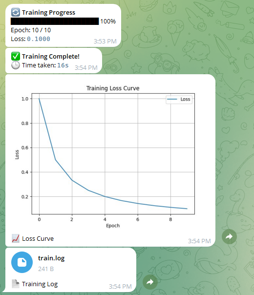

# JobMonitor_bot

This project sends training progress updates to a Telegram chat using a bot. It's designed to be lightweight, fast, and easy to set up with [uv](https://github.com/astral-sh/uv), a modern Python package manager.

---

## 🔧 Configuration

Create a `config.yaml` file in the root directory with the following content:

```yaml
telegram:
  token: '<YOUR_TELEGRAM_BOT_TOKEN>'
  chat_id: '<YOUR_TELEGRAM_CHAT_ID>'
```

---

## 🚀 Run the Script

Make sure you're in the project directory, then run:

```bash
uv run training_progress.py
```

This runs the script in an isolated environment managed by `uv`.

---

## 📦 Setting Up `uv`

If you haven't installed `uv` yet, install it using one of the following methods:

### With pipx (recommended):

```bash
pipx install uv
```

### Or using pip:

```bash
pip install uv
```

Then, create a virtual environment:

```bash
uv venv .venv --python 3.12 --seed
```

Activate the virtual environment:

- On Windows:
  ```bash
  .\.venv\Scripts\activate
  ```
- On macOS/Linux:
  ```bash
  source .venv/bin/activate
  ```

Install required packages:

```bash
uv pip install requests pyyaml matplotlib
```

---

## 🤖 Setting Up Your Telegram Bot

1. **Create a bot**:  
   Talk to [@BotFather](https://t.me/BotFather) on Telegram. Use `/newbot` to create a new bot and get a token.

2. **Get your `chat_id`**:  
   Send a message to your bot. Then go to this URL (replace `TOKEN` with your bot token):

   ```
   https://api.telegram.org/bot<TOKEN>/getUpdates
   ```

   Look for `"chat":{"id":YOUR_CHAT_ID}` in the response.

3. **Paste token and chat ID into `config.yaml`**

---

## ✅ Example Output

When `training_progress.py` runs, it sends messages to your Telegram chat with training updates (e.g., epochs, loss, etc.).



---

## 📄 License

Apache 2.0